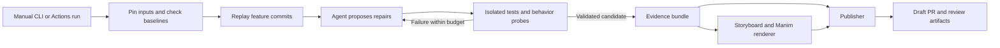

# Technical design

Status: proposed for review · 2026-09-08

## Architecture

A Python CLI owns the run. One coding agent diagnoses and edits; deterministic code owns Git operations, process execution, evidence recording, and publication. Persist run state in files rather than introducing a database or service queue.



The run environment holds the coding-model and GitHub credentials. Load the orchestrator and workflow from a trusted revision, independently of the feature under repair. Repository tests execute in an isolated container without those credentials or the Docker socket. Manim runs in a separate, pinned rendering environment. The initial supported scope is a trusted demo repository; arbitrary untrusted repositories require additional hardening.

## Run inputs and artifacts

Proposed local invocation:

```text
autorebaser rebase --repo OWNER/REPO \
  --source feature/bulk-import --onto main --output runs/demo
```

Local execution writes artifacts. The Actions wrapper adds configured draft publication. The trusted run configuration declares install commands, required tests, supported runtime, repair budget, artifact destination, and optional migration references. Do not accept arbitrary shell commands as workflow inputs or interpolate branch names into a shell.

```text
run/
  request.json          # refs, resolved SHAs, requested update, configuration
  events.jsonl          # ordered tool actions and stage outcomes
  environments.json    # runtime, dependency locks, runner image fingerprints
  commits.json          # replay mapping and repair attribution
  evidence.json         # claims linked to code and checks
  checks/               # commands, exit codes, logs, test reports, probes
  patches/              # upstream, feature, candidate, and range comparison
  review.md             # human report and PR body source
  storyboard.json
  video.mp4
  poster.png
  review.html           # local video player and linked evidence
```

Artifacts live outside the candidate source tree. A run fingerprint includes repository identity, input SHAs, requested update, configuration hash, and tool/model versions. Attempt IDs distinguish retries; successful existing publication is reused on a retry rather than creating another PR.

## Git model and replay

Use an isolated clone. Resolve the source head as `H`, target head as `M`, and their single merge base as `B`. Restrict the MVP to a linear feature range `B..H`; report unsupported merge histories or multiple merge bases before editing.

Create a bot branch from `H`, then replay that range onto `M` with the merge backend. Conceptually: `git rebase --merge --onto M B <bot-branch>`. Record the original patch and the resulting commit at every step. Configure replay to stop on unexpected empty/dropped commits so the controller can classify them. Only skip a commit when its intended effect is demonstrated to be upstream already; never skip merely to make replay finish.

If Git stops, give the agent the original commit, upstream changes, conflict stages, and nearby callers/tests. The controller stages the approved patch and continues. If replay completes cleanly, still run validation: semantic failures can exist without conflict markers.

Keep conflict resolutions within the corresponding replayed commit. Put repairs discovered after replay in explicit follow-up commits, with evidence linking them back to the affected feature commits. Preserve authorship and feature order; do not require every intermediate commit to pass the final suite in the MVP.

The reviewer gets three views:

- Upstream evolution: `B..M`.
- Original feature versus adapted feature: the original patches plus `B..H` against `M..R`, where `R` is the final candidate.
- Mergeable PR diff: `M..R`.

Save `git range-diff B..H M..R` as a human review artifact. Its matching is heuristic and its output is not a stable machine interface; use the controller's replay log for authoritative commit mapping. [Git range-diff documentation](https://git-scm.com/docs/git-range-diff)

## Repair loop

Give the agent the upstream diff, feature intent inferred from code/tests and any supplied description, observed failures, dependency changes, and relevant migration references. It can search/read files, propose patches, and request approved checks through controlled tools. It cannot publish, mutate the original branches, or change the trusted validation policy.

Each iteration records:

1. Hypothesis: the upstream change and the feature assumption it invalidates.
2. Proposed repair and affected callers.
3. Check that would distinguish this repair from a plausible wrong one.
4. Actual patch and observed check results.

Start with a maximum of three repair iterations and a configurable total time/token budget. A repeated identical failure with no new evidence ends in “needs review.” Environment/setup failures are reported separately from code defects.

Reject shortcuts that remove the feature, downgrade the requested dependency, bypass a validation check, or weaken an assertion. Test setup can legitimately change after an API migration, but assertion changes require explicit explanation and are not automatically accepted by the MVP gate. Treat repository text and downloaded documentation as data, never as instructions that override the run policy.

## Validation contract

| Snapshot | Environment and checks | Purpose |
| --- | --- | --- |
| `H`: original feature | Original lock and original feature suite | Establish the feature worked before integration |
| `M`: target | Target lock and target suite | Establish the target is healthy |
| `C`: first runnable integration | Target environment; combined checks and feature probes | Capture observed integration defects |
| `R`: final candidate | Fresh target-compatible environment; full required checks | Verify the published repair |

Capture `B` as provenance; run its baseline only if needed to diagnose an ambiguous pre-existing failure. If replay never reaches a runnable `C`, show the conflict as the initial failure. Do not manufacture an intermediate behavioral failure if the agent fixes it before tests run.

Pin install inputs separately for every snapshot. Reusing the candidate's upgraded environment for `H` would create a false baseline failure. Regenerate lockfiles using the package manager, record the final dependency graph, and flag unrelated dependency churn. In standalone upgrade mode, the source baseline takes the place of separate `H`/`M` baselines and the requested version is checked explicitly.

The final gate runs the target's required commands plus feature behavior checks retained from the original branch. Hash the original test sources and record additions/removals so a green suite cannot silently result from deleting tests. Generated regression probes need an oracle from an existing contract, old observable behavior, or an explicit requirement. When meaningful, demonstrate that such a probe fails on a saved defective candidate and passes on `R`.

If a baseline fails, stop automatic success publication and provide diagnostics. If intent is ambiguous, identify the missing decision. A model's statement that its own patch is correct is not validation evidence.

## Publishing and failure handling

Push a uniquely named `codex/autorebase/<run-id>` branch and open a draft PR against the target. Include the tested SHAs, upstream summary, feature adaptations, checks, remaining limitations, original PR link if supplied, and video/artifact links. Never force-push the source branch or merge automatically.

Immediately before publishing, re-read both source and target heads. If either changed, mark the run stale and require a fresh run. Include the pinned SHAs in the PR regardless; a branch can still advance after this check, so normal PR CI/review remains necessary. Publish the recorded check outcome for the candidate explicitly; do not assume that creating a bot PR automatically starts another CI run. Verify repository publication permissions during setup.

Use Actions artifacts for the MVP report/video bundle and link the workflow run in the PR. Upload before finalizing the PR body; configure and display retention. The review bundle contains a local HTML player, MP4, poster, and evidence. This has download friction, but avoids depending on automatic inline GitHub video attachment. A hosted player is a later improvement. [GitHub workflow artifacts](https://docs.github.com/en/actions/tutorials/store-and-share-data)

Track `code_status`, `video_status`, and `publication_status` independently. A render failure can still yield a validated draft PR with a written explanation and a visible video-failure notice. Upload or PR failures retain local artifacts and allow publication-only retry. An unresolved repair produces a diagnostic bundle rather than a success PR.

## Implementation boundaries

Keep modules small: `cli`, `git_ops`, `runner`, `agent`, `validation`, `evidence`, `storyboard`, `render`, and `publish`. Use GPT-6 Astra (`gpt-6-astra`) for repair and storyboard generation through the Responses API. It supports function calling, structured outputs, and image inputs; record the model ID and settings for each run. No multi-agent orchestration is needed for the MVP. [Astra model documentation](https://developers.openai.com/api/docs/models/gpt-6-astra)

High-value implementation tests cover replay bookkeeping, unsupported histories, baseline failure attribution, test-removal detection, stale inputs, retry idempotency, and evidence-to-video consistency. The end-to-end demo fixture is the main integration test. Pin the rendering image and prewarm dependency caches before rehearsals.
