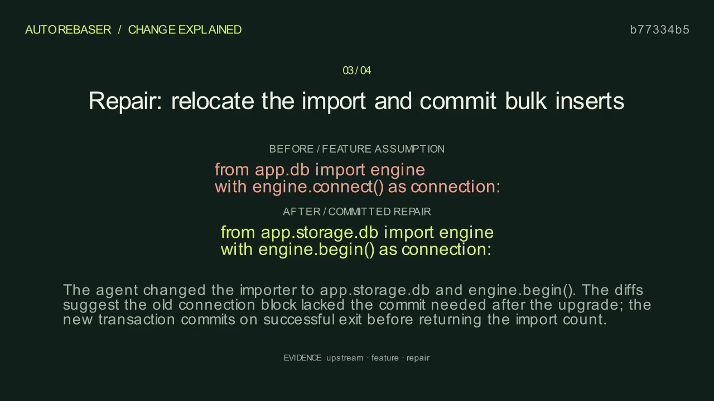

# A real Astra repair

The `astra-demo` folder is a selected, completed run. It contains the actual patches, test outputs, model-call metadata, storyboard, and rendered video. It omits dependency binaries, Git worktrees, and model prompts.

[Watch the generated explanation](astra-demo/video.mp4) · [Read the report](astra-demo/review.md) · [Inspect the two-line repair](astra-demo/patches/repair.diff)

To use the interactive report, download this repository and open `showcase/astra-demo/review.html` locally. Its assets and evidence links are relative and work together. GitHub displays HTML as source rather than hosting it.

The original feature and target pass separately. The import-only control reports five imports but persists zero rows. Astra's repaired candidate passes six tests and a separate five-record persistence probe. See [the validation record](../docs/06-implementation-and-validation.md) for limitations and measured runs.
